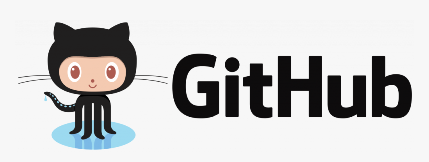

<h1 align="center">HelloI'm Mo</h1>
<h3 align="center">I'm a Junior Web Developer from Hong Kong</h3>

## 🙋‍♂️ About Me

- 👋 Hi, My name is **Mo**

- 👀 I'm interested of making new **friends**

- 🌱 I’m currently learning **web development**

- 👨‍💻  I’m looking to collaborate on **any projects**

- 📫 Please reach me **onewayup2015@hotmail.com**

- 💁‍♂️ Fun fact **I play games and go to Run very often.**

 

*******************************************************************

 

## 🚀 Languages and Tools:

 
     
     
     
     
     

<!--       -->
 

    

## 📊 My Github Stats

   
    
  
   
  <b>Note:</b> Top languages is only a metric of the languages my public code consists of and doesn't reflect experience or skill level.

 
 

 
 

## Connect with me:

## ❤ Views and Followers

